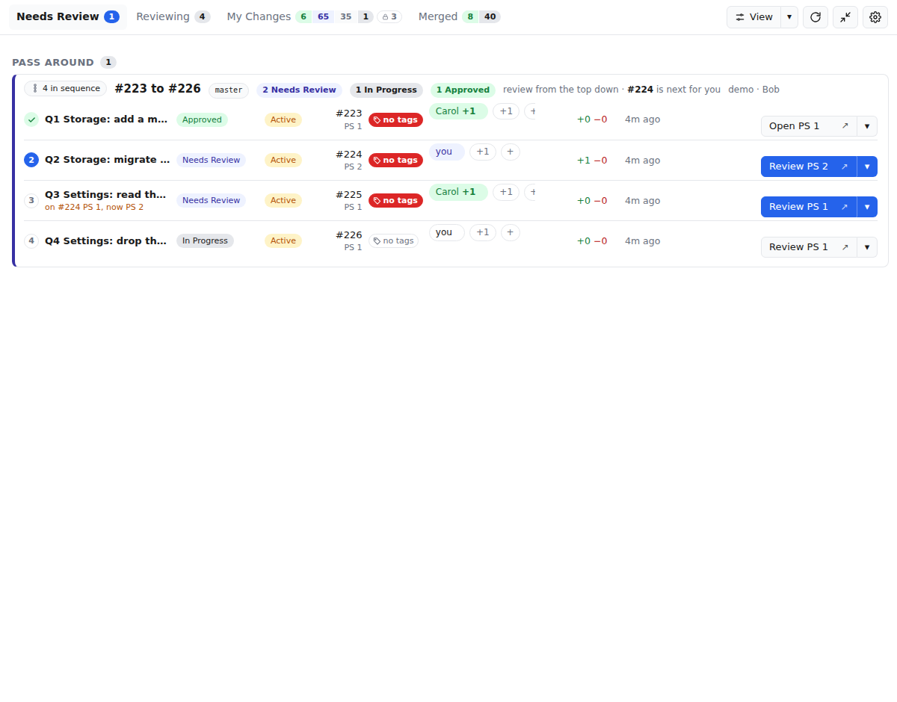
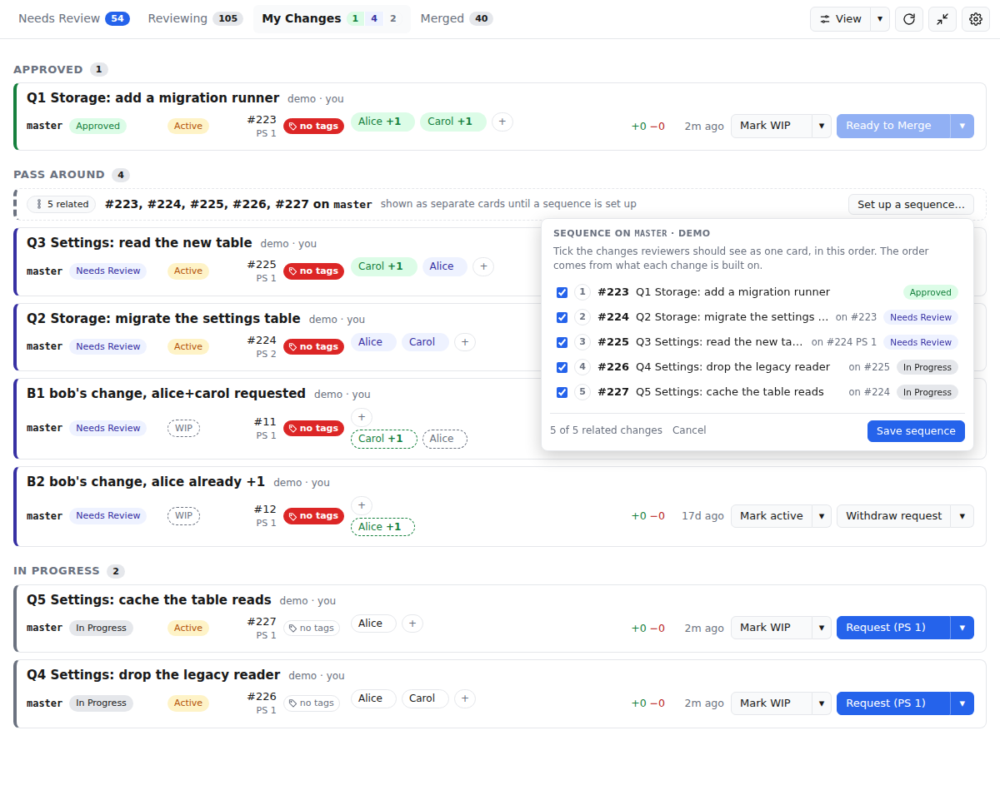
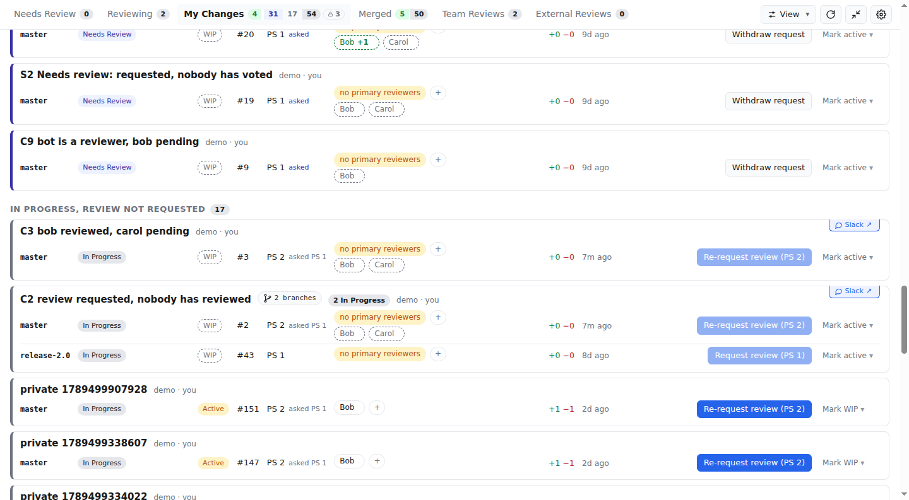
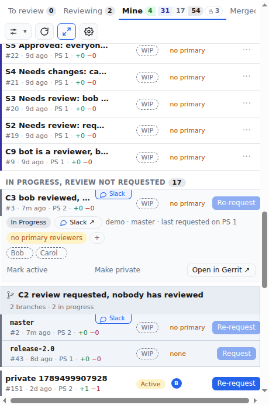
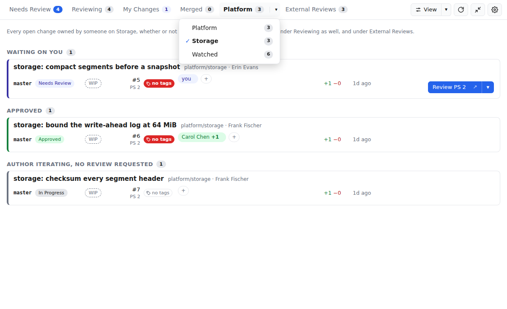

# Gerrit Review Board

Gerrit Review Board is a desktop application for Gerrit 3.11. It shows code
review as a workflow with a request and a response. The author asks for a
review of one patch set. Each primary reviewer votes on that patch set. The
result is set after the last primary reviewer votes.

The application shows three things:

- The changes that you must review
- The changes that you review
- The status of your changes

All users get the same five tabs, which go by your part on each change:
owner, reviewer, tagged primary reviewer or named merger. Two more tabs,
the team tab and "External Reviews", appear when you set teams in the
settings (refer to "Teams" below). The team tab is a watched team's whole
backlog; External Reviews is what you are on from outside your team. Neither
takes a change off the five tabs.
The "View"
button in the top bar (or Ctrl+F) opens the search, filter and sort for every
tab: a search over the subjects, an author filter, and the row order. The
author field suggests the owners of the changes on the current tab first,
then any Gerrit account; "Me" picks your own changes without typing. The
rows can be ordered by the most recent update (default), by overall age with
the oldest change first, or by the age of the current patch set with the
oldest first. The age shown on each row follows the chosen order. The
application remembers the sort; the search and filter last for the session.

| Tab | Contents |
| --- | --- |
| Needs Review | The author asked for a review of the current patch set. You are a primary reviewer. You did not vote on that patch set. The WIP status has no effect. Two sections: "Pass Around" for reviews you do on your own, "In Person" for reviews done together with the author. The count is split the same way; only the pass-around part is in the accent colour. |
| Reviewing | All open changes on which you are a reviewer, primary or not, in groups by state. |
| My Changes | Your open changes, in groups by state, with the actions of the owner. The count gains a red segment for changes that need work and a green one for approved changes. Private changes are in one section at the bottom, whatever their state. Your own are the only private changes the application shows: a private change of another author is never listed, even when you are a reviewer or CC on it. |
| Merged | Approved changes that the author asked you, by name, to merge, above the changes that Gerrit merged in the last 14 days. The count gains a green segment while anything waits on you to merge. |
| Team tab | Named after your team, or "Watched". Every open change owned by someone else on a watched team, in groups by state, whether or not you are on it. With several watched teams, a caret shows one at a time or all together. |
| External Reviews | The open changes you are on whose owner is not on your team, in groups by state. Only when you picked your team. |


## The workflow

1. The author pushes a change and adds primary reviewers with the "+"
   button on the row. It opens a checklist of your team from Settings; anyone
   else on the server can be searched for and joins the list. One button adds
   everyone checked. With "Primary" selected, the application adds each one
   as a reviewer in Gerrit, if needed, and tags the change
   `reviewer:<username>`. The primary reviewers are the people whose votes
   decide. Anyone else on the change, added in Gerrit, by CI or with the
   "Other" choice of the same button, is shown but not waited for. If the author pushes more patch sets, the state does not
   change. The application does not ask a reviewer to look at the change yet.
2. When the patch set is ready, the author pushes the "Request review" button.
   The button is off until the change has a primary reviewer. All primary
   reviewers then see the change on the "Needs Review" tab. The button asks
   for a pass-around review: each reviewer reads the change on their own.
   The caret next to it offers an in-person review instead: the reviewers
   go through the change together with the author, then vote in Gerrit the
   same way. An in-person change is listed in its own "In Person" section
   on every tab, and it is not counted in the menu bar. While the request
   is open, the caret on "Withdraw request" (or, on a later round, the
   "Pass around" / "In person" button) switches the kind without starting
   a new round.
3. Each primary reviewer pushes the "Review" button. It opens the change in Gerrit,
   showing the diff from the last patch set that reviewer looked at to the
   current one (or the whole change on a first look). The reviewer votes +1
   or -1 in Gerrit. After a reviewer votes, the application removes the change
   from the "Needs Review" tab of that reviewer.
4. After the last primary reviewer votes, the change gets the "Approved"
   state (all votes are +1) or the "Needs Changes" state (one or more votes
   are -1). Votes that come before the last vote do not change the state.
   The votes of the other reviewers never change the state.
5. If the state is "Needs Changes", the author pushes the corrections and
   pushes the "Request review" button again. The application asks all
   reviewers again, for the new patch set only. If the change still has the
   `ready-to-merge` hashtag from an earlier patch set, the button also removes
   the hashtag. The application does not remove the hashtag on its own. The
   `reviewer:` tags stay: the same people are asked again.
6. If the state is "Approved", the change is Active (not WIP) and CI voted
   Verified +1 on the current patch set, the author pushes the "Ready to
   Merge" button and picks the person to merge: one of the mergers set for the project in
   "Settings", or anyone else on the server. The change then shows
   "Ready to Merge · Dave" on "My Changes".
7. The person who was asked sees the change at the top of the "Merged" tab,
   in the tray count, and in a desktop notification. That person opens the
   change in Gerrit, votes +2 and submits it there; the application has no
   merge button. Nobody else is asked; if the merger cannot merge, the author
   picks someone else with "Change merger".

Refer to `docs/walkthrough.md` for the same flow with a screenshot of each
step, from the developer's, a reviewer's and the merger's window.

The WIP status is not part of this workflow. A change can go through the full
workflow with the WIP status. The application shows WIP or Active as a
separate badge with a separate switch. This is useful if you use WIP to stop
CI until the review is complete. The "Ready to Merge" button does not remove
the WIP status; it is disabled until the change is Active and Verified +1, so
the merger is only asked once CI has passed.

The Verified vote on the current patch set is shown after the patch set
number on an open change: a green check for +1, a red cross for −1, nothing
while CI has not voted. A new patch set clears it, as it clears the vote.

## How the states are related to Gerrit data

The application has no database. The application calculates each state from
data that Gerrit already has. Thus, a user who looks at Gerrit directly sees
the same votes, hashtags and WIP flags.

| Workflow item | Gerrit data |
| --- | --- |
| Request review | The application appends the number of the current patch set to the custom keyed value `review-requested-ps` of the change, a comma-separated list of every patch set asked about, in order: `2,4,5`. |
| In-person review | The request also sets the custom keyed value `in-person-review-ps` to the number of the current patch set. A pass-around request removes it. The value counts only while it equals the current patch set and a review is requested for that patch set; a push after the request drops the kind with the request. |
| Withdraw request | Removes `review-requested-ps` and `in-person-review-ps`. Offered only for a first request on the current patch set that no primary reviewer has voted on; later rounds stay on record. |
| Switch kind | Sets or removes `in-person-review-ps` for the current patch set; `review-requested-ps` is not touched, so the round stays as it is. |
| Primary reviewer X | The change has the hashtag `reviewer:<username>`, with the Gerrit username of X in lower case, or the email address for an account with no username. One tag per primary reviewer. |
| Needs Review by X | The last number in `review-requested-ps` is the same as the number of the current patch set. X is a primary reviewer. X has no Code-Review vote on the current patch set. |
| In-Person Review | As Needs Review, and `in-person-review-ps` is the number of the current patch set. Everything else is the same: the votes of the primary reviewers decide, and the last vote sets Approved or Needs Changes. |
| Iterating | No review is requested for the current patch set, and a primary reviewer voted on an earlier patch set listed in `review-requested-ps`. The vote is read from the change messages, since Gerrit drops the votes of earlier patch sets from the labels. Shown on My Changes only; a reviewer sees these as In Progress. |
| Reviewer finished | X has a Code-Review vote (+1 or -1) on the current patch set. |
| "+" button, "Primary" | For each person checked: adds them as a reviewer of the change in Gerrit, when they are not one yet, then adds the `reviewer:` tag. One account per tag; a group is refused. |
| "×" on a primary reviewer | Removes the `reviewer:` tag, then tries to remove the reviewer in Gerrit. Gerrit lets only the owner, an administrator or the person themself do the second part; for anyone else the tag goes and the person stays on the change as an other reviewer. |
| "↑" and "↓" on a reviewer | Adds or removes the `reviewer:` tag only. The person stays on the change in Gerrit. |
| Review button | Opens Gerrit at `/c/<project>/+/<change>/<last>..<current>`, where `<last>` is the highest patch set with a vote or reply from you in the change messages. Without one, it opens the current patch set against base. The caret offers the other diffs and the change page. |
| Needs Changes | All primary reviewers voted on the current patch set. One or more of them voted -1. |
| Approved | All primary reviewers voted +1 on the current patch set. There is at least one primary reviewer. |
| Ready to Merge | The state is Approved, the change has the hashtag `ready-to-merge`, and the custom value `ready-to-merge-ps` equals the current patch set number. A tag for an earlier patch set (or without the value, from an older version) is stale: the change stays Approved and asking Ready to Merge again, or re-requesting review, writes over it. |
| Ready to Merge button | Enabled when the state is Approved, the change is not WIP, and the `Verified` label has a +1 (or higher) vote and no negative vote on the current patch set. The application adds the hashtags `ready-to-merge` and `merger:<username>` in one request, then sets the custom value `ready-to-merge-ps` to the current patch set number. The username is the Gerrit username of the person asked, in lower case; the email address for an account with no username. A change has one `merger:` tag; "Change merger" replaces it. |
| Asked of you | The change is Ready to Merge and the `merger:` tag names your username or email address. |
| Slack thread | The change has the hashtag `slack:<url>`, where `<url>` is an https link on `slack.com` or a workspace under it. The board shows it as "Slack ↗" and opens it in the browser, or in the Slack app when Settings knows the workspace. One per change; a tag whose value is not a Slack link is ignored. |
| Tagged without a merger | The change is Ready to Merge and has no `merger:` tag. Only an older version of the application makes this. Every user with +2 sees it. |
| Merge | Done in the Gerrit web UI: the merger votes +2 and submits there. The application only lists the change. |

These rules have these effects:

- When a user pushes a new patch set, Gerrit removes the votes that are not
  sticky. The last number in `review-requested-ps` is then different from
  the number of the current patch set. Thus, a new push puts the change back
  in the "In Progress" state, or in "Iterating" when a reviewer had voted on
  a patch set that was asked about. The application does not ask a reviewer.
  A trivial rebase keeps the copied votes. Thus, an approved change stays
  approved after a trivial rebase.
- A +2 vote does not count for the "Approved" state. Gerrit has no query that
  tells if a user can submit a change before the change is submittable. The
  application cannot warn the author that the person picked has no +2; the
  person asked finds out in Gerrit.
- The merger is not added as a reviewer or CC. Gerrit itself sends the merger
  nothing. The application is the notification channel, so a merger who does
  not run the application learns of the request from the author.
- "Re-request review" and "Clear ready-to-merge" remove the `merger:` tag
  together with the `ready-to-merge` tag.
- Only the owner of the change or an administrator can write custom keyed
  values. Thus, a reviewer cannot request a review for a different user.
- Anyone may add or remove a `reviewer:` tag, if Gerrit lets them edit
  hashtags. Gerrit grants "Edit Hashtags" to the owner and administrators
  only by default. Grant it to "Registered Users" on the project, or on
  `All-Projects`, so that reviewers can tag each other. `test/seed-gerrit.sh`
  shows the REST call.
- A `reviewer:` tag for a person who is not a reviewer of the change in
  Gerrit still counts. The application shows the person with a dotted
  outline and waits for their vote, and the person sees the change on their
  own board. This happens when someone removes the reviewer in Gerrit but
  not the tag, or writes the tag by hand.
- A change with reviewers but no `reviewer:` tag has nobody to decide. It
  stays in "Needs Review" after a request, and the "Request review" button
  is off until a primary reviewer is tagged. Changes made before this
  version have no tags: tag the reviewers, with "↑" on each chip.
- The application does not use the attention set.
- Bots and the owner do not count as reviewers, tagged or not. Bots are the
  members of the Gerrit "Service Users" group.
- The Gerrit `reviewer:` search operator does not find WIP changes. Thus,
  the application also scans the open WIP changes of other owners and keeps
  the changes on which you are a reviewer. On a large server, set a project
  scope in "Settings" to keep this scan small. If Gerrit truncates a result,
  the application shows a warning.

## One change on several branches

A cherry-pick to another branch is a separate change in Gerrit. It keeps the
Change-Id of the original commit. The application shows the changes that
have the same Change-Id as one card. Each branch is a row in the card. A
change on one branch is a card with one row, so both read the same way.

- The card is in the section of its most urgent branch. The order of
  urgency is the same for the owner and for a reviewer: Needs Changes, Needs
  Review, Iterating, In Progress, Approved, Ready to Merge. If two branches have the
  same state, the card goes to the earlier section. Thus, on "Reviewing", a
  branch that waits on you comes before a branch that you reviewed.
- Each row shows the branch, the state, a "Private" badge on a change that
  is private in Gerrit, the WIP or Active badge, the change number, the patch set, the reviewers with their votes, the size of the
  diff, the time of the last update and the buttons of that change. The
  cards in a section share the same columns. Each branch is reviewed on its
  own. A vote on the master change does not count for the release change.
- The reviewers fit on one line. Reviewers who voted come first, a -1 before
  a +1. If there are too many, the rest are behind a "+N" chip. Point at it
  to see their names, or click it to show them all.
- A merged branch stays in the card. The row is grey, shows when the change
  was merged and has no buttons. Thus, while you work on a release branch,
  you can see that the change is already in on master. On the "Recently
  Merged" tab, the merged branch leads the card and the open branches are
  below it.
- The counts on the tabs and on the sections count cards, not changes. A
  family is one card, so it counts once however many branches it has, and
  a section counts only the cards under it. The card header says how many
  branches are in each state, for example "1 Approved · 2 Needs Review".
- In the compact window the card is a box in the section: a header line
  with the subject and the number of branches, then one line per branch,
  titled by the branch. Each line opens like any other line of the ledger.


`docs/mockups/change-id-groups/` has five mockups of ways to show a group.
The application uses mockup 3.

## A sequence of changes

Commits pushed together on one branch become one change each, and Gerrit
submits a change only after the ones below it. The owner can show such
changes to reviewers as one card, in the order they are built on each
other, with the "sequence" hashtag on each one.

- On "My Changes", changes of yours that are built on each other and not
  yet in a sequence get a dashed card above them: "#61, #62, #63, #64 on
  master" with a "Set up a sequence…" button. The button opens a checklist
  of those changes, base first, every one ticked. Untick any change that
  should stay on its own, then save. The application writes the tag on the
  ticked changes.
- Tagged changes that are built on each other form one card, on every tab,
  with a row per change, base first. The subject is in the first column,
  with a step number in front: a tick once the change is approved or
  merged, blue on the change a reviewer should read next, which is the
  lowest one that waits on them. The head line names the sequence (its
  topic, or the first and last change numbers), the branch, and how many
  changes are in each state. A change built on an older patch set of the
  one below it says so, "on #62 PS 1", since a rebase is due.
- The head line of your own sequence has an "Edit sequence…" button. It
  opens the same checklist with the members ticked. Untick everything to
  dissolve the sequence.
- The tag only says which changes to show together. Which change is built
  on which comes from the commits: an untagged change in the middle of a
  line splits the sequence in two, a tagged change whose parent is not
  tagged is the base of its sequence, and a tagged change with no tagged
  parent or child is an ordinary card.
- Nothing else changes. Request review, Ready to Merge, the reviewers and
  the votes stay per change, and only the owner sets or clears the tag. A
  sequence is one card in the counts, like a family. A cherry-pick of a
  member on another branch is a card of its own.
- In the compact window the sequence is a box like a family, the lines
  titled by their subjects with the step in front, and the dashed offer is
  one header line.





`docs/mockups/dependency-chains/` has five mockups of the card, five of the
picker and five of the button that opens it; the application uses the first
of each, the fourth for the button.

## Slack threads

A review sometimes has a conversation on Slack. To keep it with the change,
link it: point at the card, and a dashed "+ Slack" tab hangs from its top
edge at the right; it opens a panel with one field. Paste the link from "Copy link" on
the Slack message. The application stores it as the hashtag `slack:<url>` on
the change, so Gerrit shows it too, as a hashtag chip on the change page.
The tab then reads "Slack ↗" and opens the conversation; its "×", shown on
hover, removes the tag. In the compact window the
same tab hangs from the top edge of the line, over the right end of the
subject, and opens the conversation without opening the line; the detail
row has the link as a pill. The owner and every reviewer of an open change
may link or unlink; a change has one link, a new one replaces it. Only https links on `slack.com` or a workspace under it are accepted, so
a tag written by hand cannot open another site.

The conversation opens in the browser, unless "Slack" in Settings lists the
workspace. Slack's "Copy link" names the workspace by its subdomain
(`acme` in `acme.slack.com`), but the Slack app opens a message only by the
workspace's team ID (`T0123ABCD`, or the org's `E…` ID on Enterprise
Grid), which the link does not carry; the
settings page says where to read it off. With the row present, the tab
turns the https link into `slack://channel?team=…&id=…&message=…` (with the
`thread_ts` of a reply) and opens that, so the Slack app comes to the
front on the message. The change keeps the https link, so Gerrit and
anyone without the setting open it in a browser; and so does the board when
the workspace is not listed, the link is not to a channel or message, or
the Slack app cannot be opened. The browser build of the board always uses
the browser.





`docs/mockups/slack-link/` has five mockups of ways to show the link, and a
screenshot of the tag in the Gerrit web UI. The application uses mockup 7.

## Settings

The gear at the right of the tab row opens the settings in place of the
board, like a tab; any tab click closes them. The page has one section per
entry in its left column (Team, Mergers, Scope, Slack, App icon, Window,
Menu bar, About), and "Connection" at the bottom, which opens the connection window.
There is no Save button: every control is written as soon as it changes, and
the board follows at once. A "Saved" or "Saving…" pill in the section
header shows the state of the last write. Text fields are written when they
lose focus or on Enter. In the compact window the column is a picker above
the section.

## Teams

In "Settings", under "Teams", add a team by name, then the people on it.
Enter a username or an email address, or start to type and select an
account from the server. The comparison ignores case. Add as many teams as
you like. Pick one of them as "Your team"; the first team you add is picked
for you, and "None" is a choice too. You are always on your own team, so
you do not need to add yourself to it.

Each team has a "Watch" box. A watched team's open changes are all on the
board, whether or not you are on them; your own team is always watched. A
team that is not watched only names its people: the changes of theirs that
you are on show as usual. So an engineer watches their own team, and a
lead watches several.

The teams have no say in the state of a change, nor in the five regular
tabs and the tray counts: the primary reviewers, tagged on each change,
decide the state (refer to "The workflow"), and your part on a change
decides the tabs. A request from an owner on another team is on "Needs
Review" like any other. The teams add two tabs:

- The team tab, named after your team, or "Watched" when you have not
  picked one, lists every open change owned by someone else on a watched
  team, in groups by state, whether or not you are on it. With several
  watched teams the tab has a caret: it opens each team with its count,
  and "Watched" for all of them together. The label does not change; the
  line above the list says which team is showing. The tab is there once a
  team is watched.
- The "External Reviews" tab lists the open changes you are on, as a
  reviewer, a tagged primary reviewer or the asked merger, whose owner is
  not on your team. It is there only when you picked your team. A watched
  team's change you have no part in is on the team tab and not here.

Both tabs are a second listing: the changes on them that you are on, or
that wait on you, are on "Reviewing", "Needs Review" or "Merged" as well.
Your own changes are on "My Changes" and on neither tab, whoever reviews
them. Someone on two teams is listed under both.

Without any team, both tabs are hidden. The teams are a setting of your
computer. Each team member enters the same lists. A settings file from
before teams had names is read as one team, named "Team", picked as yours
and watched.





## Mergers

In "Settings", under "Mergers", list the people to offer when you ask for a
merge, by project. A row is a project and the people for it. The project is
an exact name, a prefix ending in `*`, or `*` alone for every project. A
change in `platform/core` gets the people from the rows `platform/core`,
`platform/*` and `*`, most specific row first.

The "Ready to Merge" button opens that list, with the person asked last time
for that project preselected. Once asked, the button reads "Change merger"
and opens the same list; "Clear ready-to-merge" is a link in that menu. "Someone else" searches the accounts on the
server for a one-off request; a checkbox under the search adds that person
to the row for the project. The list only fills the menu: a wrong or empty
list costs one search. It is a setting of your computer, and it does not
have to match anyone else's.

The person who was asked sees the change on the "Merged" tab under
"Asked of you", and nowhere else on that tab: a request for somebody else is
not listed. A person without +2 rights who was asked by mistake sees the
change with a hint to tell the author.


## The tray icon

The application stays open. It is independent of the browser.

The tray icon shows what waits on you, in four categories and always in this
order. The counts are cards, as on the tabs: a change on several branches
counts once per category, however many of its branches need that action.

| Category | Color | Glyph | Meaning |
| --- | --- | --- | --- |
| Needs Review | Blue | ◉ | The author asked you to review the current patch set. |
| Needs Changes | Red | ✎ | Your change has the "Needs Changes" state. |
| Approved | Green | ◆ | Your change is approved. Push "Ready to Merge". |
| Ready to Merge | Purple | ⇧ | The author asked you to merge the change. |

On macOS, the menu bar item shows one colored count per category that is not
zero. If you cannot tell the colors apart, select "Show glyphs instead of
colored counts" in the settings. The item then shows the glyph and the count
as text. The counts take the place of the app icon; the icon shows only when
nothing waits on you. Select "Always show Needs Review, Needs Changes and Approved, even at
zero" to keep those counts in place. The Ready to Merge count appears only when
someone asked you to merge, because most users never are. On Windows and Linux, the total is part of
the icon image, because these trays cannot show text. Clear "Show counts on
the menu bar icon" in the settings to keep the plain icon on every platform.
The tooltip and the tray menu show the counts by category on all platforms,
also with the counts off. A category in the tray menu opens a submenu with
one row per card: the number, the subject, the branch and, on Needs Review
and Ready to Merge, the owner. A row opens the change in the browser; on
Needs Review it opens the diff the Review button opens. A change on several
branches is one row that opens a submenu of its branches; a branch that does
not need the action is greyed out with the reason, so the family reads whole.
The last row of a submenu opens the tab that lists those changes, and a
category at zero opens its tab directly. Clicking the tray icon opens the
menu only; it does not raise the board window. The tray menu also has
Open board, Refresh, Compact window, Compact window stays on top, and Quit, and a
disabled row with the version and the
short git commit the build was made from (a trailing `+` means the working
tree had uncommitted changes). The total goes to the macOS dock, the Linux
launcher and the Windows taskbar overlay. Clear "Show the total as a badge
on the app icon" in the settings to turn that badge off.

Compact mode is a narrow window with a layout made for 320 to 460 pixels.
The tabs have short names in a strip that scrolls sideways. The board is a
table with one line per change: the subject, the WIP or Active state, the
reviewers as initials with their vote, and the one main button for that
change. Tap a line to open it. The open line shows the state, the reviewer
chips with add and remove, the other buttons, and a link to the change in
Gerrit. Start compact mode with the shrink button in the top bar or from the
tray menu. By default the compact
window stays on top of the other windows and moves with you to each
workspace. To turn that off, clear "Compact window stays on top" in
"Settings" or in the tray menu. The full-size window is never pinned. The
application keeps the position of the normal window and the position of the
compact window separately.

If you close the window, the application hides the window in the tray. To
stop the application, use "Quit" in the tray menu. Only one instance of the
application can run. If you start the application again, the application
shows the window that is already open.

## Start the application

You must have Node 22 or a newer version and pnpm. The `packageManager`
field in `package.json` gives the pnpm version. To get that version, run
`corepack enable` one time.

```sh
pnpm install
pnpm dev           # development build with hot reload
pnpm build && pnpm start
pnpm dist          # packaged application in dist/ (AppImage, dmg, nsis)
```

To install the application, download the signed build for your platform
from the GitHub releases page rather than packaging it yourself: only the
signed release build can update itself.

The `electron` package does not download the Electron binary at install time.
The `dev`, `build`, `start` and `dist` scripts download the binary first if it
is not present. On Ubuntu 24.04 and newer versions, the kernel does not permit
unprivileged user namespaces. The same scripts then show a one-time root
command that corrects the Electron sandbox.

The packaged AppImage has the same requirement on these systems. The usual
correction there is `sudo sysctl -w kernel.apparmor_restrict_unprivileged_userns=0`.

At the first start, a "Connection" window opens. Enter the server URL, your
username and an HTTP password, and press "Test and save". The same window
opens later from "Connection" at the bottom of the settings page; it is the
only place that tests the connection and reloads the board.
Make the HTTP password in Gerrit under "Settings", "HTTP Credentials". The
server URL is the base URL of Gerrit. Include the path prefix. For example,
enter `https://host/gerrit1`, not only the host. You can also paste the URL of
a change or a dashboard. The application cuts that URL to the base URL. The
application stores the password with Electron `safeStorage`, which uses the
keychain of the operating system.

REST calls go through the Chromium network stack. Thus, the application trusts
the certificates that the operating system trusts, and it uses the proxy
settings of the system. You must install a private CA in the store that
Chromium reads:

| OS | Where to install the CA |
| --- | --- |
| macOS | Keychain Access, System or login keychain. Set the CA to "Always Trust". |
| Windows | Certificate store, "Trusted Root Certification Authorities". |
| Linux | The NSS user database, not the OpenSSL bundle: `certutil -d sql:$HOME/.pki/nssdb -A -t "C,," -n "Private CA" -i ca.crt` (package `libnss3-tools`). |

To see if the network stack of the application trusts a server, run
`pnpm exec electron scripts/net-check.cjs https://your-gerrit/`.

## Releases

Every pull request runs the "CI" workflow in GitHub Actions. It runs the
typecheck, the unit tests and the build, then the integration test against a
Gerrit 3.11 container, and lints the workflow files and the release scripts.
It then runs the same "Build" workflow the release uses, unsigned, on Linux,
macOS and Windows, checks that every release file is there (installers,
`latest*.yml` manifests, macOS `.zip` archives and `.blockmap` files), and
runs the publish script as a dry run against the downloaded artifacts. So a
change that breaks packaging, drops a release file or breaks the release
job's wiring fails on the pull request, not after the merge. The workflow
uses no secrets, so it also runs on pull requests from forks.

GitHub runs no CI on a pull request that has a merge conflict; the checks
just do not appear. The "Merge check" workflow fills that gap. It runs when
a pull request is opened or gets a new commit, also with a conflict, and
fails with a message when GitHub reports the pull request as not mergeable.
Rebase the branch, resolve the conflict and push again; the CI workflow then
runs. The workflow uses the `pull_request_target` event, so it takes effect
for a pull request only after the workflow file is on `main`, and it never
runs code from the pull request.

Every push to `main` (a merged pull request) runs the "Release" workflow in
GitHub Actions. The workflow builds the AppImage, the macOS DMG for Intel and
Apple silicon, and the Windows installer, uploads them one at a time to a
draft release, checks that every file landed, and publishes it; GitHub
creates the `v` tag at that commit on publish. A failed run leaves the draft
behind, and the next run reuses it. The version comes from
`scripts/pick-version.sh` (tested by `test/pick-version.test.sh`): the one in
`package.json` when it is newer than every `vX.Y.Z` tag; otherwise the
workflow bumps the patch number of the newest tag. To release a new minor or
major version, raise the version in `package.json` in the pull request.

A push of a tag that starts with `v` (for example `v0.2.0`) releases that
exact version. A manual run of the workflow makes a draft release instead.

### Updates

The desktop application checks the releases of this repository for a newer
version shortly after it starts and then once an hour. When one exists, a
button in the top bar offers to download it. The download checks once more
first, so a release published since the last check is the one downloaded. The download runs in the
background, and the button then offers a restart to finish the install. Nothing is downloaded or installed without a click. Settings has an
About section with the version, the release notes and a "Check for updates"
button, and the tray menu has the same action.

The updater reads the files the release workflow attaches next to the
installers: the `latest*.yml` manifests, the macOS `.zip` archives and the
`.blockmap` files. A release made by hand needs them too. On macOS the
application must be signed to update itself; the workflow signs it, a local
`pnpm dist` build does not, and that build reports an error on download
instead. Refer to `docs/testing.md` to try the flow from the source
tree.

The macOS build is signed with a Developer ID certificate and notarized with
an App Store Connect API key. The workflow reads these from the repository
secrets `CSC_LINK` (base64 of the `.p12`), `CSC_KEY_PASSWORD`,
`APPLE_API_KEY` (the text of the `.p8`), `APPLE_API_KEY_ID` and
`APPLE_API_ISSUER`. Linux and Windows builds are not signed.

## Browser mode

Electron needs a display. On a machine without a display, for example with VS
Code Remote SSH, you can use the same UI in a browser. Run:

```sh
pnpm web
```

This command starts two servers. The local API server is at 127.0.0.1:5174.
This is the part of the application that does not use Electron. The Vite
development server is at http://localhost:5173/. VS Code forwards this port
automatically. The application writes the settings that you enter in the
browser to `~/.config/gerrit-gui/web-settings.json`. The password in this file
is not encrypted. As an alternative, set `GERRIT_URL`, `GERRIT_USER` and
`GERRIT_PASSWORD` in the environment. The tray icon, the badge and compact
mode do not operate in a browser. All other functions operate.

## Tests

```sh
pnpm test                                # unit tests of the classifier
docker run -d --name gerrit-test -p 8080:8080 gerritcodereview/gerrit:3.11.2
./test/seed-gerrit.sh                    # users alice/bob/carol/dave, erin from another team, primary reviewers tagged, changes in each state
./test/seed-more-states.sh               # the rest: in-person and second-round requests, stale tags, Verified, a named merger, tagged commit messages
node --test test/integration.test.ts     # runs the real REST client through the full workflow
```

Refer to `docs/testing.md` for UI checks without a display, and to
`docs/walkthrough/shoot.sh` for the script that makes the screenshots in
`docs/walkthrough.md` against an empty Gerrit.

## Fallback dashboard

If you cannot use the application, use the Gerrit dashboard in
`gerrit-dashboard/`. This is a standard Gerrit project dashboard with similar
sections. Install it one time for the full server. Refer to
`gerrit-dashboard/README.md`. The dashboard has these limits:

- It cannot show that all reviewers approved a change.
- It cannot see the review request for a patch set.
- It cannot show the WIP changes that you review.

## Layout

- `src/shared/model.ts` is the state classifier. It has only pure functions. It has unit tests.
- `src/main/service.ts` has all the functions that the UI can call. It does not use Electron.
- `src/main/gerrit.ts` is the REST client. It gets a fetch implementation as an argument. Electron gives the Chromium fetch. The tests give the Node fetch.
- `src/main/settings.ts` stores the credentials in encrypted form.
- `src/main/tray.ts` controls the tray icon and the badge.
- `src/preload/index.ts` makes the service available to the renderer as `window.api`.
- `src/server/` gives the same service on loopback HTTP for browser mode.
- `src/renderer/` is the React UI.
