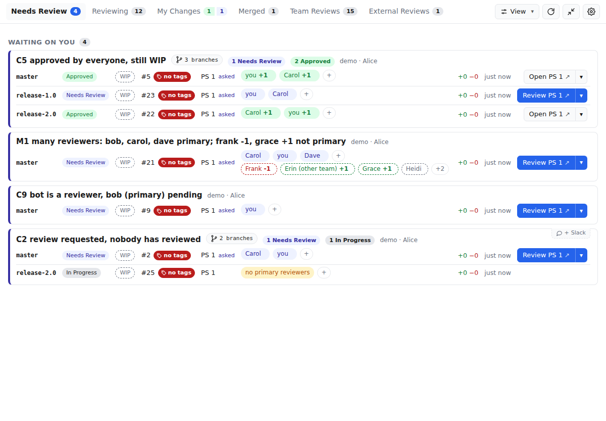

# Gerrit Review Board

Gerrit Review Board is a desktop application for Gerrit 3.11. It shows code
review as a workflow with a request and a response. The author asks for a
review of one patch set. Each reviewer votes on that patch set. The result is
set after the last reviewer votes.

The application shows three things:

- The changes that you must review
- The changes that you review
- The status of your changes

All users get the same five tabs. There are no settings for each user. A
sort control in the top bar orders the rows on every tab, either by the most
recent update (default) or by overall review age, oldest change first. The
application remembers the choice.

| Tab | Contents |
| --- | --- |
| Needs my review | The author asked for a review of the current patch set. You are a reviewer. You did not vote on that patch set. The WIP status has no effect. |
| Reviewing | All open changes on which you are a reviewer, in groups by state. |
| My changes | Your open changes, in groups by state, with the actions of the owner. |
| Ready to merge | Approved changes that the author marked for the person who has merge authority. |
| Recently merged | Changes that Gerrit merged in the last 14 days. |



## The workflow

1. The author pushes a change and adds reviewers. If the author pushes more
   patch sets, the state does not change. The application does not ask a
   reviewer to look at the change yet.
2. When the patch set is ready, the author pushes the "Request review" button.
   All reviewers then see the change on the "Needs my review" tab.
3. Each reviewer votes +1 or -1 on that patch set. After a reviewer votes, the
   application removes the change from the "Needs my review" tab of that
   reviewer.
4. After the last reviewer votes, the change gets the "Approved" state (all
   votes are +1) or the "Needs changes" state (one or more votes are -1).
   Votes that come before the last vote do not change the state.
5. If the state is "Needs changes", the author pushes the corrections and
   pushes the "Request review" button again. The application asks all
   reviewers again, for the new patch set only.
6. If the state is "Approved", the author pushes the "Ready to merge" button.
   The change then goes to the "Ready to merge" tab.
7. The person who has merge authority pushes the "+2 and submit" button.

The WIP status is not part of this workflow. A change can go through the full
workflow with the WIP status. The application shows WIP or Active as a
separate badge with a separate switch. This is useful if you use WIP to stop
CI until the review is complete. The "Ready to merge" button does not remove
the WIP status.

## How the states are related to Gerrit data

The application has no database. The application calculates each state from
data that Gerrit already has. Thus, a user who looks at Gerrit directly sees
the same votes, hashtags and WIP flags.

| Workflow item | Gerrit data |
| --- | --- |
| Request review | The application writes the number of the current patch set to the custom keyed value `review-requested-ps` of the change. |
| Needs review by X | The number in `review-requested-ps` is the same as the number of the current patch set. X is a reviewer. X has no Code-Review vote on the current patch set. |
| Reviewer finished | X has a Code-Review vote (+1 or -1) on the current patch set. |
| Needs changes | All reviewers voted on the current patch set. One or more reviewers voted -1. |
| Approved | All reviewers voted +1 on the current patch set. |
| Ready to merge | The state is Approved, and the change has the hashtag `ready-to-merge`. |
| Merge | The application votes +2 on the current patch set and submits the change. |

These rules have these effects:

- When a user pushes a new patch set, Gerrit removes the votes that are not
  sticky. The number in `review-requested-ps` is then different from the
  number of the current patch set. Thus, a new push puts the change back in
  the "In progress" state. The application does not ask a reviewer. A trivial
  rebase keeps the copied votes. Thus, an approved change stays approved after
  a trivial rebase.
- A +2 vote does not count for the "Approved" state. The application shows the
  merge button to users who have the Code-Review permission for +2. Gerrit has
  no query that tells if a user can submit a change before the change is
  submittable.
- Only the owner of the change or an administrator can write custom keyed
  values. Thus, a reviewer cannot request a review for a different user.
- The application does not use the attention set.
- Bots and the owner do not count as reviewers. Bots are the members of the
  Gerrit "Service Users" group.
- The Gerrit `reviewer:` search operator does not find WIP changes. Thus,
  the application also scans the open WIP changes of other owners and keeps
  the changes on which you are a reviewer. On a large server, set a project
  scope in "Settings" to keep this scan small. If Gerrit truncates a result,
  the application shows a warning.

## The tray icon

The application stays open. It is independent of the browser.

The tray icon shows what waits on you, in four categories and always in this
order:

| Category | Color | Glyph | Meaning |
| --- | --- | --- | --- |
| Review | Blue | ◉ | The author asked you to review the current patch set. |
| Fix | Red | ✎ | Your change has the "Needs changes" state. |
| Mark ready | Green | ◆ | Your change is approved. Push "Ready to merge". |
| Merge | Purple | ⇧ | The change is ready to merge, and you can vote +2. |

On macOS, the menu bar item shows one colored count per category that is not
zero. If you cannot tell the colors apart, select "Show glyphs instead of
colored counts" in the settings. The item then shows the glyph and the count
as text next to the template icon. Select "Always show all four categories,
even at zero" to keep every count in place; with colored counts the item is
then the pills alone, without the icon. On Windows and Linux, the total is part of
the icon image, because these trays cannot show text. The tooltip and the
tray menu show the counts by category on all platforms; a category in the
tray menu opens the tab that lists those changes. The tray menu also has
Open, Refresh, Compact and Quit, and a disabled row with the version and the
short git commit the build was made from (a trailing `+` means the working
tree had uncommitted changes). The total goes to the macOS dock, the Linux
launcher and the Windows taskbar overlay.

Compact mode is a narrow window that stays on top of the other windows and
moves with you to each workspace. Start compact mode with the pin button or
from the tray menu. The application keeps the position of the normal window
and the position of the compact window separately.

If you close the window, the application hides the window in the tray. To
stop the application, use "Quit" in the tray menu. Only one instance of the
application can run. If you start the application again, the application
shows the window that is already open.

## Start the application

You must have Node 22 or a newer version and pnpm. The `packageManager`
field in `package.json` gives the pnpm version. To get that version, run
`corepack enable` one time.

```sh
pnpm install
pnpm dev           # development build with hot reload
pnpm build && pnpm start
pnpm dist          # packaged application in dist/ (AppImage, dmg, nsis)
```

On macOS, `pnpm run install:mac` builds the application and copies it to
`/Applications`. If a copy of the application runs, the script stops it
first. To install in a different folder, set `INSTALL_DIR`. For example, set
`INSTALL_DIR=~/Applications` if you are not an administrator.

The `electron` package does not download the Electron binary at install time.
The `dev`, `build`, `start` and `dist` scripts download the binary first if it
is not present. On Ubuntu 24.04 and newer versions, the kernel does not permit
unprivileged user namespaces. The same scripts then show a one-time root
command that corrects the Electron sandbox.

The packaged AppImage has the same requirement on these systems. The usual
correction there is `sudo sysctl -w kernel.apparmor_restrict_unprivileged_userns=0`.

At the first start, enter the server URL, your username and an HTTP password.
Make the HTTP password in Gerrit under "Settings", "HTTP Credentials". The
server URL is the base URL of Gerrit. Include the path prefix. For example,
enter `https://host/gerrit1`, not only the host. You can also paste the URL of
a change or a dashboard. The application cuts that URL to the base URL. The
application stores the password with Electron `safeStorage`, which uses the
keychain of the operating system.

REST calls go through the Chromium network stack. Thus, the application trusts
the certificates that the operating system trusts, and it uses the proxy
settings of the system. You must install a private CA in the store that
Chromium reads:

| OS | Where to install the CA |
| --- | --- |
| macOS | Keychain Access, System or login keychain. Set the CA to "Always Trust". |
| Windows | Certificate store, "Trusted Root Certification Authorities". |
| Linux | The NSS user database, not the OpenSSL bundle: `certutil -d sql:$HOME/.pki/nssdb -A -t "C,," -n "Private CA" -i ca.crt` (package `libnss3-tools`). |

To see if the network stack of the application trusts a server, run
`pnpm exec electron scripts/net-check.cjs https://your-gerrit/`.

## Browser mode

Electron needs a display. On a machine without a display, for example with VS
Code Remote SSH, you can use the same UI in a browser. Run:

```sh
pnpm web
```

This command starts two servers. The local API server is at 127.0.0.1:5174.
This is the part of the application that does not use Electron. The Vite
development server is at http://localhost:5173/. VS Code forwards this port
automatically. The application writes the settings that you enter in the
browser to `~/.config/gerrit-gui/web-settings.json`. The password in this file
is not encrypted. As an alternative, set `GERRIT_URL`, `GERRIT_USER` and
`GERRIT_PASSWORD` in the environment. The tray icon, the badge and compact
mode do not operate in a browser. All other functions operate.

## Tests

```sh
pnpm test                                # unit tests of the classifier
docker run -d --name gerrit-test -p 8080:8080 gerritcodereview/gerrit:3.11.2
./test/seed-gerrit.sh                    # users alice/bob/carol/dave and changes in each state
node --test test/integration.test.ts     # runs the real REST client through the full workflow
```

Refer to `docs/testing.md` for UI checks without a display.

## Fallback dashboard

If you cannot use the application, use the Gerrit dashboard in
`gerrit-dashboard/`. This is a standard Gerrit project dashboard with similar
sections. Install it one time for the full server. Refer to
`gerrit-dashboard/README.md`. The dashboard has these limits:

- It cannot show that all reviewers approved a change.
- It cannot see the review request for a patch set.
- It cannot show the WIP changes that you review.

## Layout

- `src/shared/model.ts` is the state classifier. It has only pure functions. It has unit tests.
- `src/main/service.ts` has all the functions that the UI can call. It does not use Electron.
- `src/main/gerrit.ts` is the REST client. It gets a fetch implementation as an argument. Electron gives the Chromium fetch. The tests give the Node fetch.
- `src/main/settings.ts` stores the credentials in encrypted form.
- `src/main/tray.ts` controls the tray icon and the badge.
- `src/preload/index.ts` makes the service available to the renderer as `window.api`.
- `src/server/` gives the same service on loopback HTTP for browser mode.
- `src/renderer/` is the React UI.
