# Your first review, step by step

This is one change going through the whole workflow, as seen from three
windows: Alice, who wrote the change; Bob, who reviews it; and Dave, the
team lead who merges it. Carol is the second reviewer. Every screenshot is
the application as each of them sees it at that moment.

The application has no state of its own. Everything below is votes,
hashtags and one custom value on the change in Gerrit, so what you see in
Gerrit matches what you see here.

## Before you start: Settings

Each person enters the server, their username and an HTTP password. Then
two lists, the same on every computer on the team:

- **Team**: Alice, Bob, Carol and Dave. The team decides which tabs a change
  is on. Who decides a change is tagged on the change itself, below.
- **Mergers**: who to offer when asking for a merge, by project. Here,
  `platform/*` has Dave.

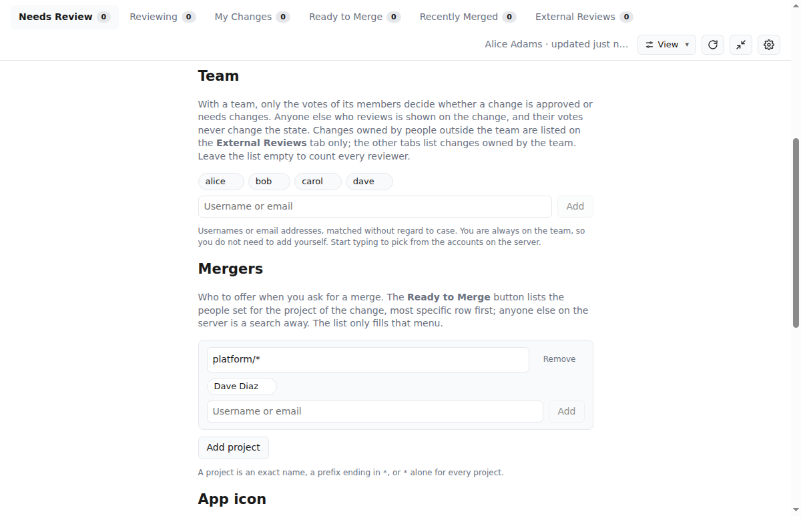

## 1. Alice pushes a change and adds reviewers

Alice pushes to `platform/core` and adds Bob and Carol as primary reviewers
with the "+" on the row: both are on her team, so she checks them in the
list and pushes "Add 2 as primary". That adds each of them as a reviewer in Gerrit
and tags the change `reviewer:bob` and `reviewer:carol`. Their votes are the
ones that decide. Had CI added a maintainer as well, that person would sit
on a dashed second line under Bob and Carol, with their vote shown and no
say in the state. Nothing is asked of anyone yet: the
change is "In Progress" on Alice's **My Changes** tab, and it is not on
Bob's **Needs Review** tab. Alice can push as many patch sets as she likes.

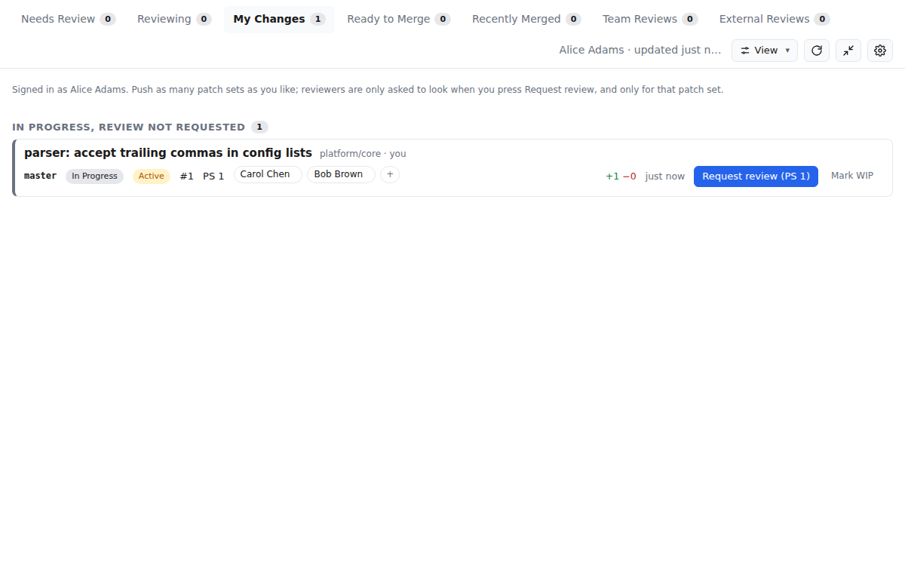

## 2. Alice requests review

When patch set 1 is ready, Alice pushes **Request review (PS 1)**. The change
moves to "Out for review" and both reviewer chips turn blue: asked, not yet
voted.

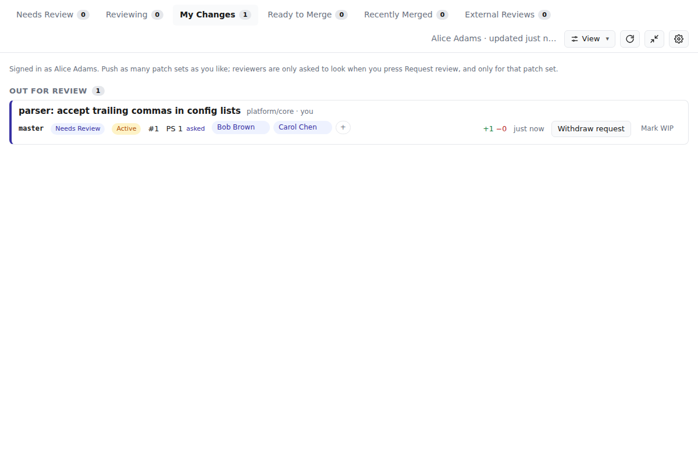

Bob now sees the change on **Needs Review**. The **Review** button opens
the diff in Gerrit. Bob votes there.

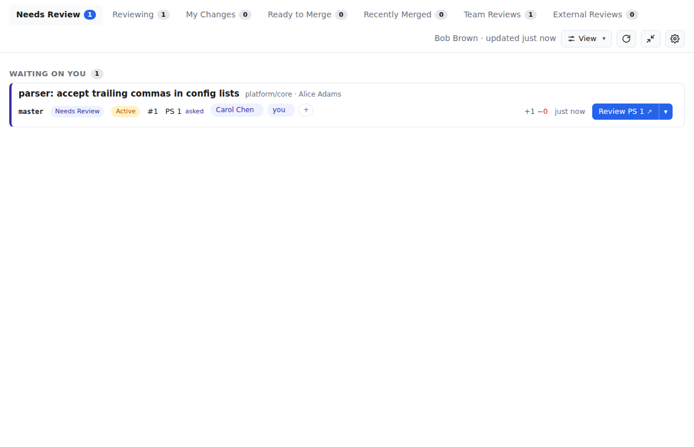

## 3. The reviewers vote

Bob votes +1. Carol votes -1 and asks for a lone comma to be handled. The
state is decided only when the last primary reviewer has voted. With both
votes in and one of them negative, the change is "Needs Changes" for Alice.
Anyone could have untagged Carol with the "↓" on her chip, and the change
would have been "Approved" on Bob's vote alone; the tags are the whole rule.

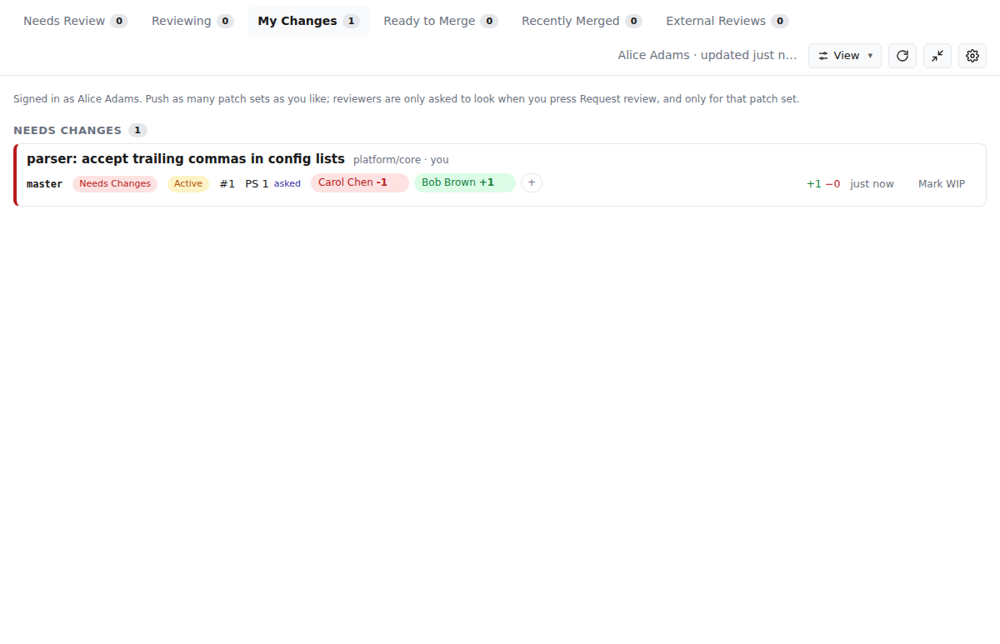

## 4. Alice pushes a fix

Alice pushes patch set 2. Gerrit clears the votes. The change goes to
"Iterating": the request was for patch set 1, so nobody is asked to look at
patch set 2 until Alice says so, and Bob's vote on patch set 1 says the
change is being worked through a review rather than still being prepared.
Had nobody voted on patch set 1, it would be "In Progress" again. The
reviewer chips are grey again.

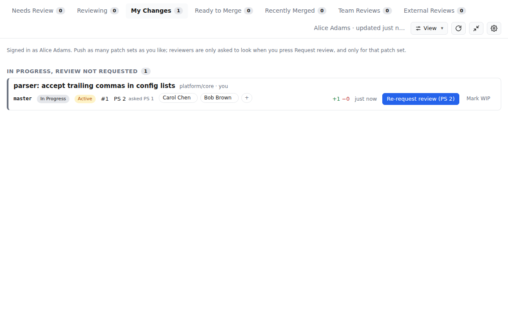

Alice pushes **Re-request review (PS 2)**. The `reviewer:` tags stay, so
the same two people are asked. Bob and Carol both vote +1. The change is
"Approved", and the primary button is now **Ready to Merge**.

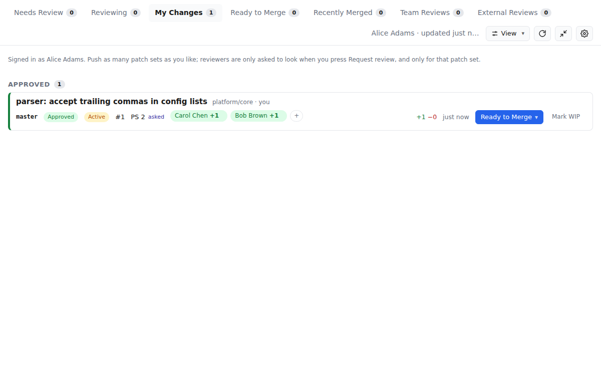

## 5. Alice asks Dave to merge

**Ready to Merge** opens a menu. The mergers for `platform/core` from
Settings are listed, Dave is preselected, and a search field finds anyone
else on the server for a one-off request. Alice confirms with
**Ask Dave Diaz to merge**.

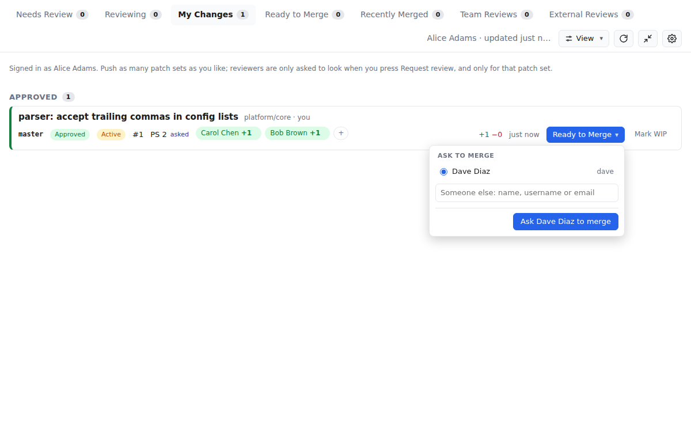

The row now reads "Ready to Merge · Dave Diaz", so Alice can see who she
asked without opening Gerrit. **Change merger** asks someone else instead.

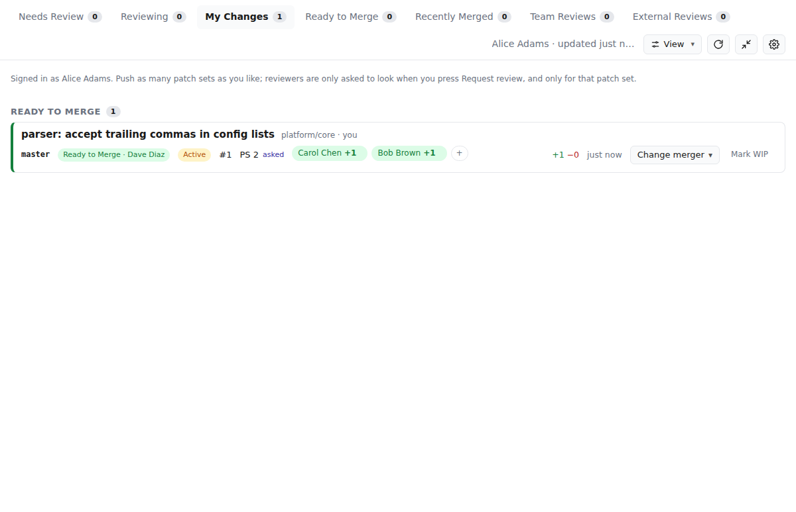

## 6. Dave merges

Dave's **Ready to Merge** tab is his queue: the changes people asked him, by
name, to merge. The tray count and a desktop notification point him here.
He opens the change in Gerrit, votes +2 and submits it there.

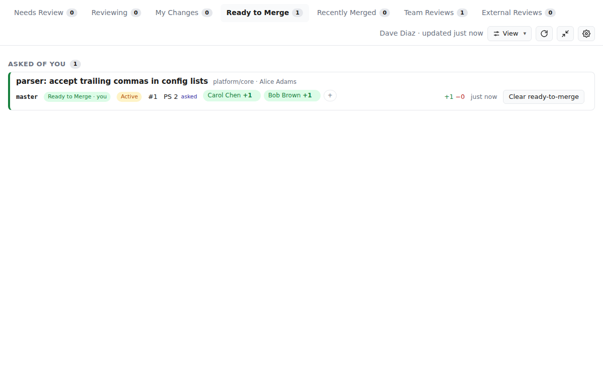

The same queue in the compact window, which stays on top of other windows:

Bob was not asked, so his **Ready to Merge** tab is empty. A request names
one person, and nobody else is prompted.

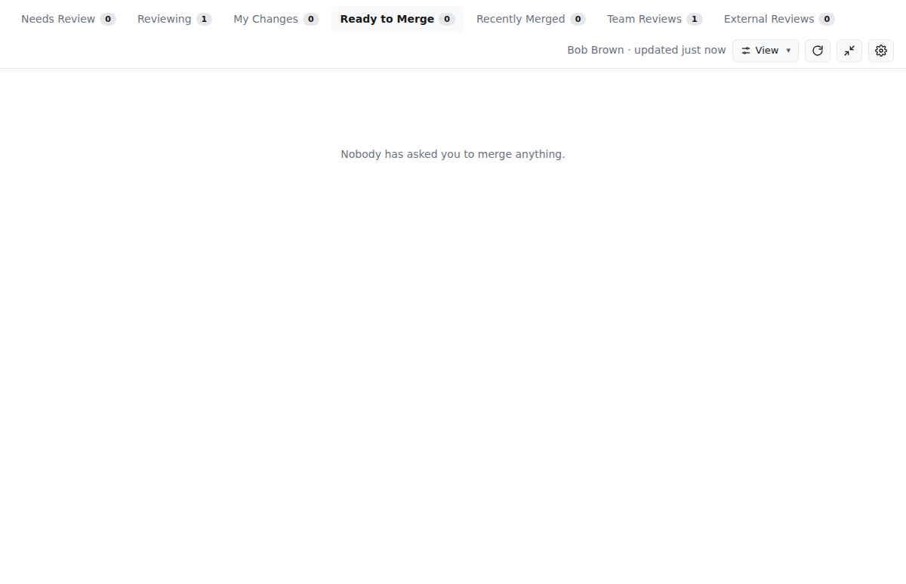

## 7. Merged

After Dave submits, the change is on everyone's **Merged** tab for
14 days.

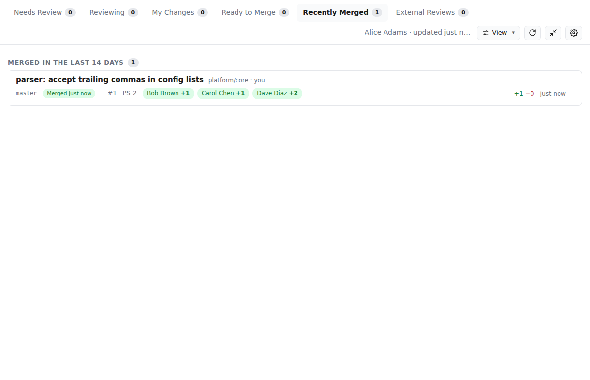

## What each button writes to Gerrit

| Button | Gerrit |
| --- | --- |
| "+" with Primary | For each person checked: adds the reviewer, then hashtag `reviewer:bob` |
| "+" with Other | For each person checked: adds the reviewer only; owner's choice |
| "↑" or "↓" on a chip | Adds or removes the `reviewer:` hashtag |
| "×" on a primary chip | Removes the `reviewer:` hashtag, then the reviewer where Gerrit allows it |
| Request review | Appends the patch set number to the custom value `review-requested-ps`. Off until a primary reviewer is tagged |
| Review | Opens Gerrit; the vote is Gerrit's own Code-Review +1 or -1 |
| Ready to Merge | Hashtags `ready-to-merge` and `merger:dave`; custom value `ready-to-merge-ps` = the patch set number |
| Change merger | Replaces the `merger:` hashtag |
| (merge) | Nothing; the merger votes +2 and submits in the Gerrit web UI |

To make these screenshots again, run `docs/walkthrough/shoot.sh` against an
empty Gerrit; the header of the script says how.
